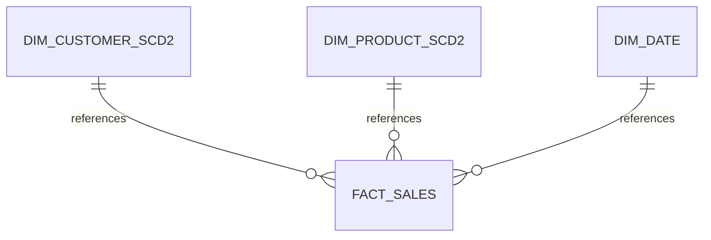
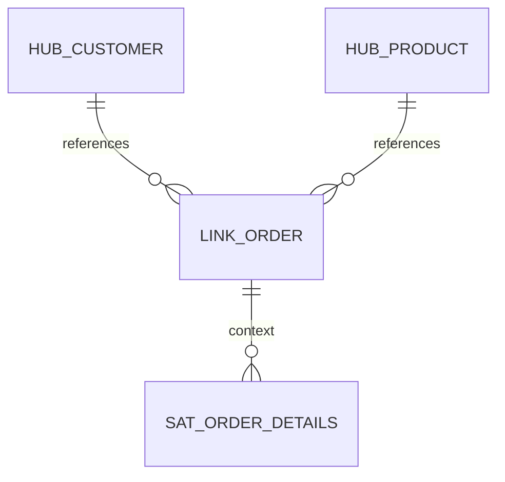

# ModelFlow Workshop Walkthrough

This document summarizes the results of the Multi-Architecture Data Modeling Workshop initialization.

## 🚀 Accomplishments

- **Infrastructure**: Provisioned a DuckDB-backed dbt environment using `uv` and `dbt-duckdb`.
- **Data Factory**: Implemented `data_factory_init.ipynb` which generates 1,000 customers, 50 products, 2,000 orders, and ~1,200 shipments.
- **Three Modeling Architectures**:
    - **Data Vault 2.0**: Hubs, Links, and Satellites with hash keys (MD5) and Business Vault views.
    - **Inmon 3NF**: Normalized entities (3rd Normal Form) with hard referential integrity tests.
    - **Star Schema**: Dimensional model with SCD Type 2 tracking, surrogate keys, and BI-ready marts.
- **Verification**: Created 200+ tests ensuring data integrity across all layers and architectures.
- **Visualization**: Created `modeling_results_viewer.ipynb` providing data previews and Mermaid ERD diagrams for each methodology.

---

## 🏗️ Technical Implementation

### Medallion Architecture
- **Bronze**: Shared staging views cleaning raw seed data.
- **Silver**: Core domain modeling (Raw Vault, CDW 3NF, SCD2 Dimensions).
- **Gold**: Consumable assets (Business Vault, Reporting Aggregations, BI Marts).

### Comparative ERDs
The following diagrams (available in `modeling_results_viewer.ipynb`) demonstrate the structural differences:

#### Star Schema (BI Optimized)


#### Data Vault (Audit & Scale)


---

## ✅ Validation Results

All 28 dbt models and 200+ tests have passed successfully.

```bash
# Final Test Summary
PASS=28  models
PASS=200 tests
```

### Key Documentation Files
- [README.md](README.md): Full project documentation and architecture comparison.
- [modeling_results_viewer.ipynb](modeling_results_viewer.ipynb): Data previews and ERD diagrams.
