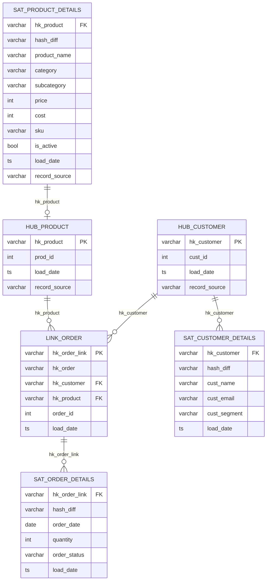
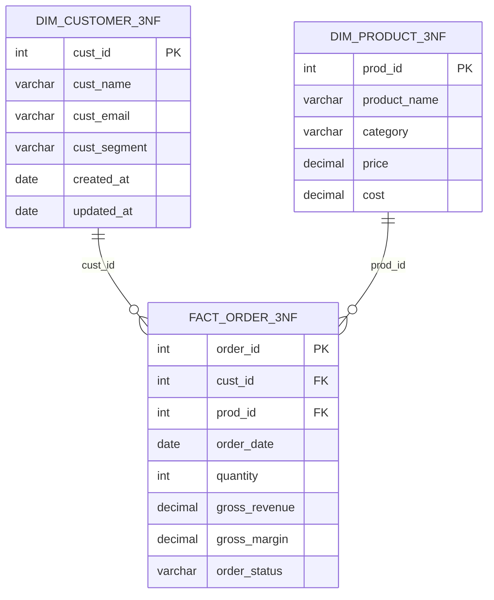
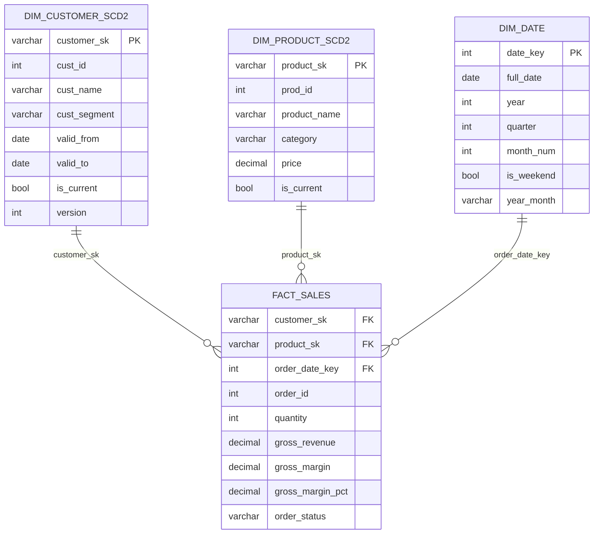

# ModelFlow — Workshop Conclusion & Walkthrough

This document is the capstone reference for the **Multi-Architecture Data Modeling Workshop**. It summarises everything you built, explains the design decisions behind each methodology, and gives you a framework to choose the right architecture for real-world projects.

---

## What You Built

Using a single shared e-commerce dataset (seeds → DuckDB), you implemented **three parallel data modeling architectures** from raw data through to BI-ready outputs — all within a single dbt project.

### Dataset

| Seed Table | Rows | Description |
|---|---|---|
| `raw_customers` | 1,000 | Customer profiles with `created_at` / `updated_at` timestamps |
| `raw_products` | 50 | Product catalog with price, cost, category, SKU |
| `raw_orders` | 2,000 | Order transactions with discount, channel, payment method, status |
| `raw_shipments` | ~1,500 | Shipment records linked to orders |

Generated by [data_factory_init.ipynb](data_factory_init.ipynb) and loaded via `dbt seed`.

---

## Architecture Overview

All three paths share the same **Bronze → Silver → Gold medallion structure** and read from identical Bronze staging views. The divergence begins at Silver.

```
seeds/ (raw_customers, raw_products, raw_orders, raw_shipments)
    │
    └──► Bronze (Views): Staging, type casting, hash key computation
              │
              ├──► DataVault/silver/   → Hubs, Links, Satellites (Raw Vault)
              │         └──► DataVault/gold/    → Business Vault (assembled views)
              │
              ├──► Inmon3NF/silver/   → 3NF CDW Entities (dim + fact)
              │         └──► Inmon3NF/gold/     → Pre-aggregated Reports
              │
              └──► StarSchema/silver/ → SCD2 Dimensions + Date Dim + Fact
                        └──► StarSchema/gold/   → Fully Denormalized BI Marts
```

### DuckDB Schemas Created

| Schema | Architecture | Layer | Key Tables |
|---|---|---|---|
| `raw` | All | Seed | `raw_customers`, `raw_products`, `raw_orders`, `raw_shipments` |
| `dv_bronze` | Data Vault | Bronze | `bronze_dv_stg_customers/orders/products` |
| `dv_silver` | Data Vault | Silver | `hub_customer`, `hub_product`, `link_order`, `sat_*` |
| `dv_gold` | Data Vault | Gold | `bv_customer_latest`, `bv_sales_summary`, `py_bv_customer_rfm` |
| `inmon_bronze` | Inmon 3NF | Bronze | `bronze_3nf_stg_customers/orders/products` |
| `inmon_silver` | Inmon 3NF | Silver | `dim_customer_3nf`, `dim_product_3nf`, `fact_order_3nf` |
| `inmon_gold` | Inmon 3NF | Gold | `rpt_sales_by_customer`, `rpt_sales_by_product`, `py_rpt_customer_ltv` |
| `ss_bronze` | Star Schema | Bronze | `bronze_ss_stg_customers/orders/products` |
| `ss_silver` | Star Schema | Silver | `dim_customer_scd2`, `dim_product_scd2`, `dim_date`, `fact_sales` |
| `ss_gold` | Star Schema | Gold | `mart_sales_dashboard`, `mart_product_performance`, `py_mart_sales_anomaly` |

---

## Architecture Deep Dives

### Data Vault 2.0

**Philosophy**: Separate business keys (Hubs), relationships (Links), and descriptive attributes (Satellites). Nothing is ever overwritten — all data is append-only.

#### Layer-by-layer

**Bronze** — Staging with hash key computation using the shared `hash_key` and `hash_diff` macros.

**Silver (Raw Vault)**:
- `hub_customer` — unique `(hk_customer, cust_id)` with first `load_date`
- `hub_product` — unique `(hk_product, prod_id)` with first `load_date`
- `link_order` — relationship record connecting `hk_customer`, `hk_product`, `hk_order`
- `sat_customer_details` — descriptive attributes for customers (append-only, CDC via `hash_diff`)
- `sat_product_details` — descriptive attributes for products
- `sat_order_details` — point-in-time order attributes (latest row per `hk_order_link`)

**Gold (Business Vault)**:
- `bv_customer_latest` — Hub + latest Satellite snapshot joined into a current-state view
- `bv_sales_summary` — Assembled from Link + all Satellites; computes `gross_revenue` and `total_cost`
- `py_bv_customer_rfm` *(Bonus C)* — RFM segmentation (Champions / Loyal / Potential / At Risk / Hibernating) using `pd.qcut` percentile binning

#### ERD



---

#### 🛠️ Data Vault Frameworks & Automation

While this workshop uses manual dbt SQL and custom macros to build the Data Vault, in production environments you may consider using specialized dbt packages to automate the generation of Hubs, Links, and Satellites:

- **[datavault4dbt](https://github.com/datavault4dbt/datavault4dbt)**: A comprehensive framework for Data Vault 2.0 on dbt.
- **[automateDV](https://automatedv.readthedocs.io/)**: (Formerly *dbtvault*) Focuses on automating the Raw Vault and some Business Vault structures.

> [!IMPORTANT]
> Currently, these frameworks primarily support enterprise backends like **Snowflake, BigQuery, and Databricks**. 
> **DuckDB is not natively supported** by these frameworks at this time. This is why we implement the logic manually in this workshop using custom macros (`hash_key.sql`, `hash_diff.sql`), giving you full visibility into the underlying DV2.0 logic.

---


### Inmon 3NF (Corporate Data Warehouse)

**Philosophy**: Atomic, non-redundant, subject-oriented entities in Third Normal Form. Every fact references dimensions via natural keys. Hard referential integrity is enforced at the test layer.

#### Layer-by-layer

**Bronze** — Light cleansing only (trim, lower, cast). No hash keys. Natural keys are preserved as-is.

**Silver (3NF CDW Entities)**:
- `dim_customer_3nf` — PK: `cust_id` (natural key). No surrogate keys in 3NF.
- `dim_product_3nf` — PK: `prod_id`. Contains price and cost (used by the fact for revenue computation).
- `fact_order_3nf` — PK: `order_id`. FKs: `cust_id → dim_customer_3nf`, `prod_id → dim_product_3nf`. Computes `gross_revenue`, `total_cost`, `gross_margin` via a join to `dim_product_3nf`.

**Gold (Reporting)**:
- `rpt_sales_by_customer` — Pre-aggregated revenue metrics per customer: `total_orders`, `total_gross_revenue`, `avg_order_value`, `customer_lifetime_days`
- `rpt_sales_by_product` — Equivalent aggregation by product category
- `py_rpt_customer_ltv` *(Bonus C)* — Customer Lifetime Value with projected annual value and CLV tier (High / Medium / Low) based on purchase frequency projections

#### ERD



**Key design constraints enforced by tests**:
- No orphan customer or product FK in `fact_order_3nf` (`assert_3nf_referential_integrity`)
- `test_no_transitive_dependency` — fact columns must not contain attributes that functionally belong to a dimension

---

### Star Schema (BI-Optimized)

**Philosophy**: Optimize for query performance and BI tool consumption. Surrogate keys everywhere. SCD Type 2 preserves dimension history. Fully denormalized Gold marts avoid runtime joins.

#### Layer-by-layer

**Bronze** — Cleansing + denormalized `unit_price` / `unit_cost` computed at staging for downstream fact efficiency.

**Silver (Dimensional Model)**:
- `dim_customer_scd2` — SCD Type 2 with `customer_sk` (surrogate key via `dbt_utils.generate_surrogate_key`). Two rows generated for customers where `updated_at > created_at`. Columns: `valid_from`, `valid_to`, `is_current`, `version`.
- `dim_product_scd2` — Same SCD2 pattern. PK: `product_sk`.
- `dim_date` — Calendar dimension from 2023-01-01 to 2026-12-31 using `dbt_utils.date_spine`. PK: `date_key` (YYYYMMDD integer). Attributes: year, quarter, month, week, day, is_weekend, quarter_label, year_month.
- `fact_sales` — PK implied by `order_id`. FKs: `customer_sk`, `product_sk`, `order_date_key`. Measures: `quantity`, `unit_price`, `gross_revenue`, `gross_margin`, `gross_margin_pct`. SK lookup uses `is_current = true` only.

**Gold (BI Marts)**:
- `mart_sales_dashboard` — Fully denormalized wide table joining `fact_sales` + all three current dimensions. Zero joins at BI query time.
- `mart_product_performance` — Product-centric aggregations for category performance tracking
- `py_mart_sales_anomaly` *(Bonus C)* — Monthly revenue anomaly detection per product category using a 3-month rolling mean ± 2 standard deviations (`is_anomaly` flag + `deviation_pct`)

#### ERD



**Key design constraints enforced by tests**:
- `test_scd2_no_gap_no_overlap` — SCD2 validity ranges must be contiguous and non-overlapping per `cust_id`
- `assert_star_fact_no_orphan_keys` — All surrogate keys in `fact_sales` must resolve to valid dimension records (customer SK, product SK, and date key)


---

## Architecture Comparison

| Aspect | Data Vault 2.0 | Inmon 3NF | Star Schema |
|---|---|---|---|
| **Primary Key** | MD5 Hash Key (surrogate) | Natural Key | Surrogate Key (dbt_utils) |
| **History Tracking** | Satellites (append-only) | Updated in-place | SCD Type 2 rows |
| **Referential Integrity** | Soft (hash-validated tests) | Hard (FK tests on natural keys) | Surrogate FK tests |
| **Query Complexity** | High — must join Hub + Link + Sat | Medium — normalized entity joins | Low — pre-joined marts |
| **Storage** | High (append-only, no deletes) | Low (single row per entity) | Medium (SCD2 multiplies rows) |
| **Source Agility** | Very High — hubs absorb new sources | Low — schema changes require 3NF refactoring | Medium |
| **Audit Trail** | Built-in (`load_date`, `record_source`) | External | External |
| **BI Readiness** | Low — requires Business Vault layer | Medium — report layer needed | High — marts are query-ready |
| **Best For** | Enterprise EDW, regulatory audit, multi-source integration | Operational systems, CDC, normalized reporting | Self-service BI, dashboards, OLAP |

### When to Choose Which

**Choose Data Vault 2.0 when**:
- You integrate from many heterogeneous sources
- You need a full immutable audit trail (regulatory compliance)
- Your source schemas change frequently
- You need to backfill or re-process historical data safely

**Choose Inmon 3NF when**:
- You need a single source of truth for operational reporting
- Your data is well-understood and schema-stable
- Hard referential integrity between entities is non-negotiable
- You're building a CDW that feeds downstream data marts

**Choose Star Schema when**:
- Your primary consumers are BI tools (Power BI, Tableau, Looker)
- Query performance on large aggregations matters most
- Your analysts prefer wide, self-contained tables
- You can accept the trade-off of controlled denormalization

---

## Key Takeaways

1. **Same data, three different truths** — all three architectures answer the same business questions but make different trade-offs between flexibility, query complexity, storage, and auditability.

2. **The medallion layers are architecture-agnostic** — Bronze/Silver/Gold is an organizational pattern, not tied to any modeling philosophy. Each architecture maps its own semantics onto those layers.

3. **Hash keys enable decoupling** — Data Vault's MD5 hash keys allow hubs to be loaded independently of satellites and links, enabling parallel ingestion and late-arriving data handling.

4. **Surrogate keys hide source volatility** — Star Schema surrogate keys insulate the fact table from upstream source key changes, at the cost of a lookup join during fact loading.

5. **Tests are as important as models** — The singular and custom generic tests encode business invariants (no orphan keys, deterministic hashing, SCD2 continuity) that schema tests cannot express.

6. **SQL-first, Python when justified** — dbt's Python models add powerful analytical capabilities, but the DAG, testability, and performance advantages of SQL should remain the default.

7. **`DBT_MODE` is a learning scaffold** — The `exercise/` vs `solution/` split lets you attempt each model independently and verify your implementation against a reference without leaving the same dbt project.

---
